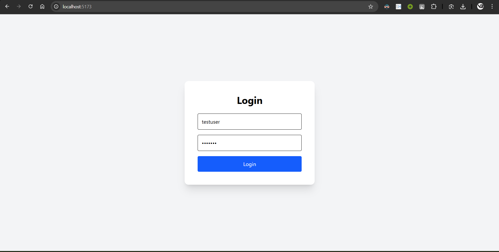
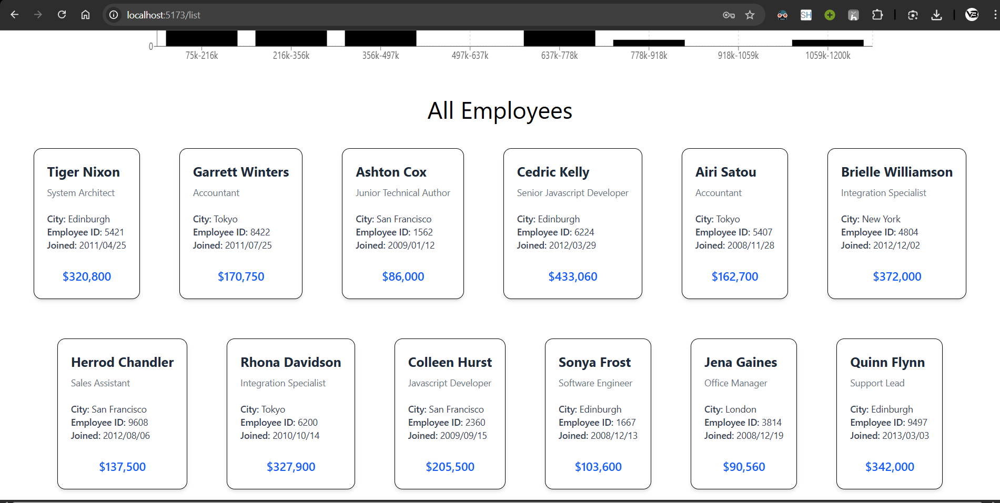
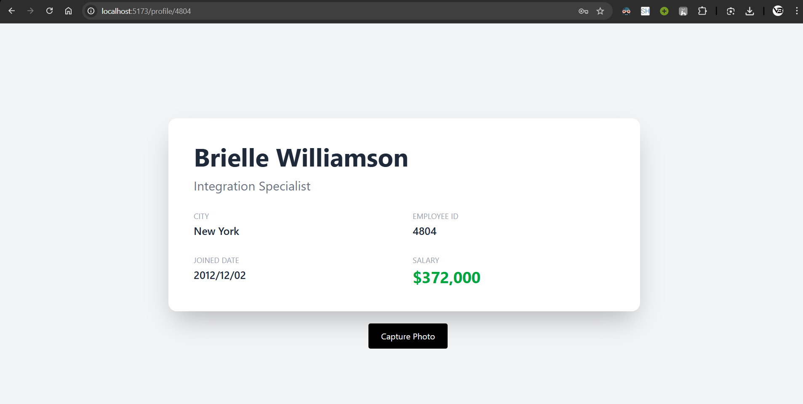
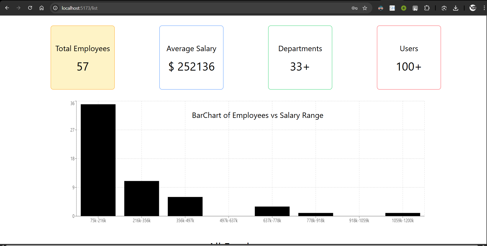

# Jotish-assignment 

## Pages

- **Login** – Hardcoded validation (testuser / Test123)
- **List** – Fetches employee data from REST API, shows cards, stats, bar chart, and map
- **Details** – Dynamic route `/profile/:id`, displays employee profile + camera capture
- **Photo Result** – Displays captured image (stored in route state)

---

## Tech Stack

- ReactJS (Vite)
- React Router DOM
- Tailwind CSS
- Recharts
- shadcn ui
- MediaDevices API
- REST API 

---

## API

POST:  
https://backend.jotish.in/backend_dev/gettabledata.php

Body:
```
{
  "username": "test",
  "password": "123456"
}
```

---

## Run

```
npm install
npm run dev
```

---

## Screenshots




